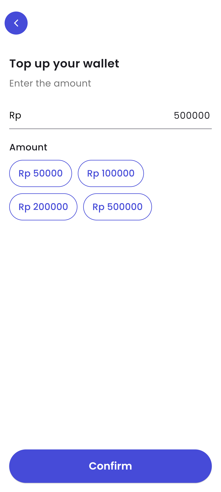
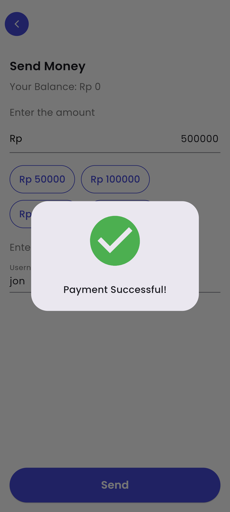
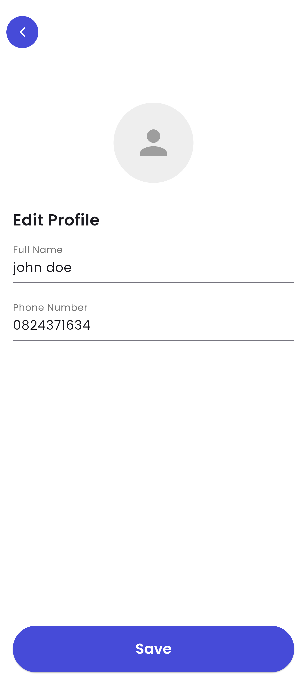

# E-Wallet

A modern digital wallet application built with Flutter, featuring secure authentication, real-time balance management, and seamless payment processing.

## Features

- Secure Authentication - Firebase-powered user registration and login
- Balance Management - Real-time wallet balance tracking
- Payment Processing - Send and receive money instantly
- Cross-Platform - Runs on iOS, Android, and Web
- Modern UI - Clean, intuitive interface with smooth animations
- Cloud Storage - Firestore database for reliable data persistence

## Screenshots

<div align="center">
  
  
  
  
</div>

## Getting Started

### Prerequisites

- [Flutter SDK](https://flutter.dev/docs/get-started/install) (3.5.0 or higher)
- [Firebase Account](https://firebase.google.com/)
- Dart SDK

### Installation

1. Clone the repository
   ```bash
   git clone https://github.com/yourusername/e-wallet.git
   cd e-wallet
   ```

2. Install dependencies
   ```bash
   flutter pub get
   ```

3. Configure Firebase
   - Create a new Firebase project
   - Add your platform-specific configuration files
   - Enable Authentication and Firestore

4. Run the app
   ```bash
   # For web
   flutter config --enable-web
   flutter run -d web-server
   
   # For mobile
   flutter run
   ```

## Tech Stack

- **Framework**: Flutter
- **Language**: Dart
- **Authentication**: Firebase Auth
- **Database**: Cloud Firestore
- **State Management**: Flutter Bloc
- **UI**: Google Fonts, Iconsax icons
- **Architecture**: Clean Architecture with BLoC pattern

## Platforms Supported

- Android
- iOS
- Web
- Linux
- macOS
- Windows

## License

This project is licensed under the MIT License - see the [LICENSE](LICENSE) file for details.
